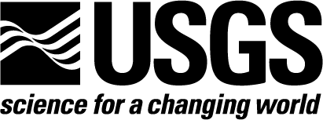

 

# FEV

### Version 2 of the Flood Event Viewer (FEV)

---

## App Features

#### Event URL Parameter

To go directly to an event view on load, append `#{event name}` to the URL. Example: `stn.wim.usgs.gov/FEV#Sandy`. If arriving without event in URL, user will be directed, via modal, to choose an event first before proceeding.

#### Guide to NWIS real-time layer

FEV contains a USGS NWIS real-time streamgage layer to display gage data for the period of the event specified. A graph of stage in elevation feet is generated on-the-fly using the HighCharts library. Proper time period display is dependent on proper event management in the STN database - an invalid event date range may result in a failure to retrieve data. FEV defaults to showing the last 7 days of real-time gage data for any absent or invalid event date range.

FEV displays NWIS sites of the following type:

- ES - Estuary
- LK - Lake, Reservoir, Impoundment
- OC - Ocean
- OC-CO - Coastal
- ST - Stream
- ST-CA - Canal
- ST-DCH - Ditch
- ST-TS - Tidal stream

[Full NWIS site type list](http://maps.waterdata.usgs.gov/mapper/help/sitetype.html)

The following parameter codes are used to display water level:

- 00065 (Gage height, feet)
- 62619 (Estuary or ocean water surface elevation above NGVD 1929, feet)
- 62620 (Estuary or ocean water surface elevation above NAVD 1988, feet)
- 63160 (Stream water level elevation above NAVD 1988, in feet)
- 72279 (Tidal elevation, NOS-averaged, NAVD88, feet)

#### Guide to Rapid Deployment Gage (RDG) layer

FEV contains a layer for RDGs. The RDG layer reflects the RDGs recorded in the STN database, which is essentially a metadata record for the sensor, with the option to include files such as photos and diagrams. Actual time-series data is recorded by the NWIS database. USGS staff that record the RDG in the STN database must include a USGS NWIS site ID for the RDG in order to associate the records and allow FEV to display a water level graph and link to the NWISWeb data page. FEV retrieves RDG water level time-series data from NWIS for the date range of the chosen event using the [Instantaneous Values Web Service](http://waterservices.usgs.gov/rest/IV-Service.html).

Parameter codes used to display water level:

- 62620 (Estuary or ocean water surface elevation above NAVD 1988, feet)
- 00065 (Gage height, feet)
- 00067 (Tide stage, code)
- 72214 (Lake or reservoir elevation above International Great Lakes Datum (IGLD), feet)

An absent or invalid NWIS site ID will result in a "No NWIS Data Available for Graph" message, and no NWISWeb link will be provided to the user. NWIS site IDs have a length range between 8 and 15 digits, thus any ID provided that is shorter than 8 characters or longer than 15 is invalid and will result in no graph or link. One common mistake is to omit the leading zero of an ID (for example: entering '2092576' instead of '02092576').

A graph and link will also not appear if there is an invalid response from NWIS web services. If you expect to see RDG time-series data in FEV and it does not appear, confirm the NWIS site ID is correct and valid in STNWeb. If it is and the data still does not appear, please review the site's data availability in NWIS.

[Lookup NWIS parameter codes](http://nwis.waterdata.usgs.gov/usa/nwis/pmcodes)

---

## Developer Instructions

Use node version 11.15.0

run `npm install` AND `bower install` to get dependencies after first cloning

`gulp watch` to run in browser with watch for debugging

`gulp` to build project

## Built With

- [jQuery](https://jquery.com/)
- [Leaflet](http://leafletjs.com/) - Map interface
- [NPM](https://www.npmjs.com/) - Dependency Management

## Contributing

Please read [CONTRIBUTING.md](CONTRIBUTING.md) for details on the process for submitting pull requests to us. Please read [CODE_OF_CONDUCT.md](CODE_OF_CONDUCT.md) for details on adhering by the [USGS Code of Scientific Conduct](https://www2.usgs.gov/fsp/fsp_code_of_scientific_conduct.asp).

## Versioning

We use [SemVer](http://semver.org/) for versioning. For the versions available, see the [tags on this repository](../../tags).

Advance the version when adding features, fixing bugs or making minor enhancement. Follow semver principles. To add tag in git, type git tag v{major}.{minor}.{patch}. Example: git tag v2.0.5

To push tags to remote origin: `git push origin --tags`

\*Note that your alias for the remote origin may differ.

## Authors

- **[Blake Draper](https://github.com/BlakeDraper)** - _Lead Developer_ - [USGS Web Informatics & Mapping](https://wim.usgs.gov/)
  Mapping](https://wim.usgs.gov/)

See also the list of [contributors](../../graphs/contributors) who participated in this project.

## License

This software is in the Public Domain. See the [LICENSE.md](LICENSE.md) file for details

## Suggested Citation

In the spirit of open source, please cite any re-use of the source code stored in this repository. Below is the suggested citation:

`This project contains code produced by the Web Informatics and Mapping (WIM) team at the United States Geological Survey (USGS). As a work of the United States Government, this project is in the public domain within the United States. https://wim.usgs.gov`

## About WIM

- This project authored by the [USGS WIM team](https://wim.usgs.gov)
- WIM is a team of developers and technologists who build and manage tools, software, web services, and databases to support USGS science and other federal government cooperators.
- WIM is a part of the [Upper Midwest Water Science Center](https://www.usgs.gov/centers/wisconsin-water-science-center).

---
